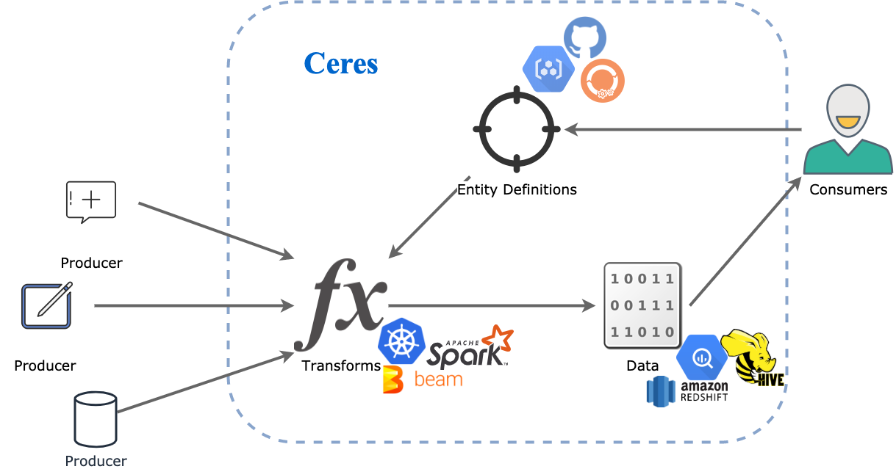

# Ceres

Ceres is an framework for managing data entities particularly aimed at 
enterprises.

Usually enterprises (and other complex environments) often have
multiple sources of generated data aggregated into meaningful entities in some
form of data warehousing. These entities are generally managed by DBA teams, 
which define and change them for a wide number of consumers.

Recently, with the rise to popularity of machine learning, the definition of
entities and how the define the business environment has become ever more 
important. Change in a definition could impact many models often now taking
on the important task of autonomous decision making. 

Various data lineage tools have significantly increased the visibility of how
entities are generated and what sources contribute to the definition of these
entities. Yet the management and deployment of new entity definitions is not
fully completed.

Ceres tries to make the management of entities easier by assuming the following
principles.

* Entities are defined by consumers not producers or data teams
* Data flow is tightly coupled to entity definitions
* Entities are services, and therefore should be life-cycled as such.

The high level architecture for Ceres is shown below.
